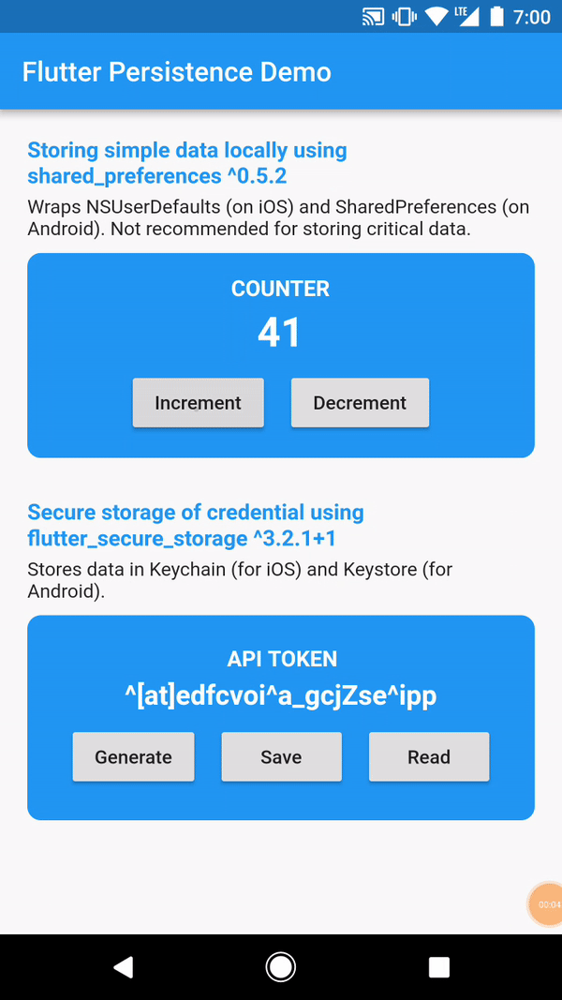
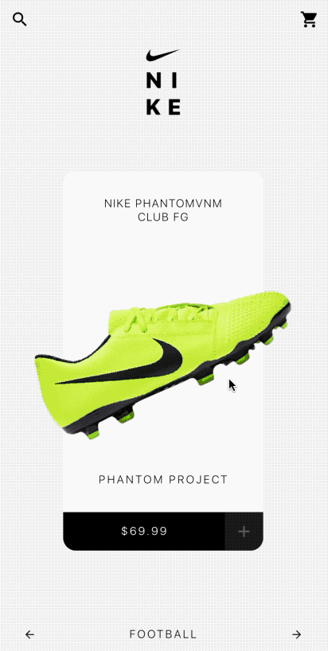
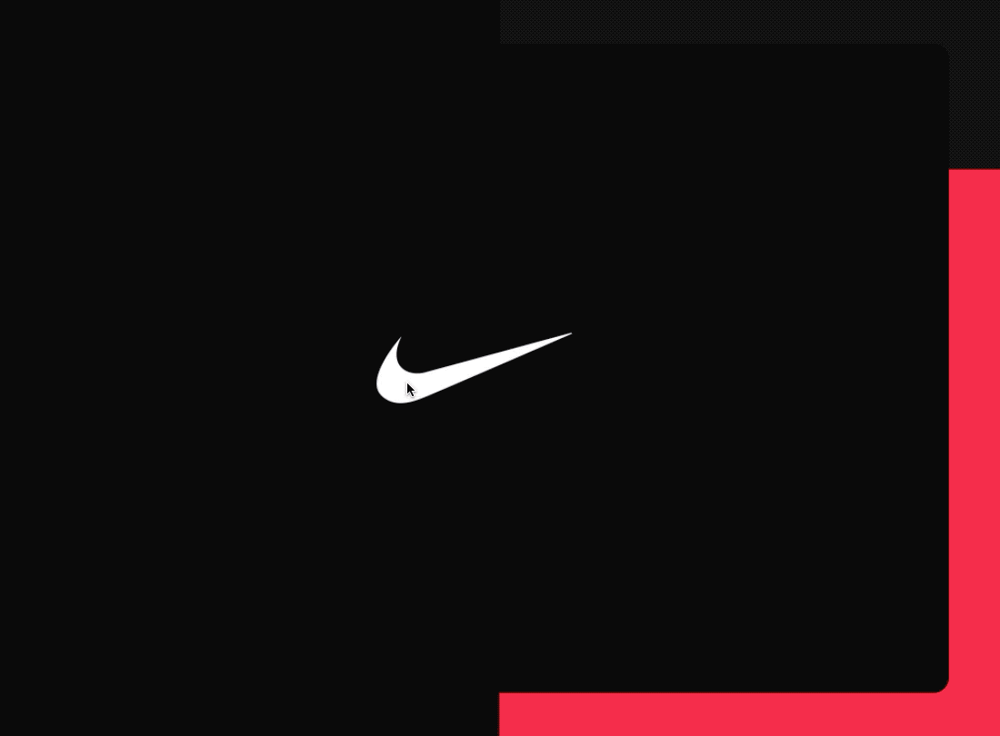
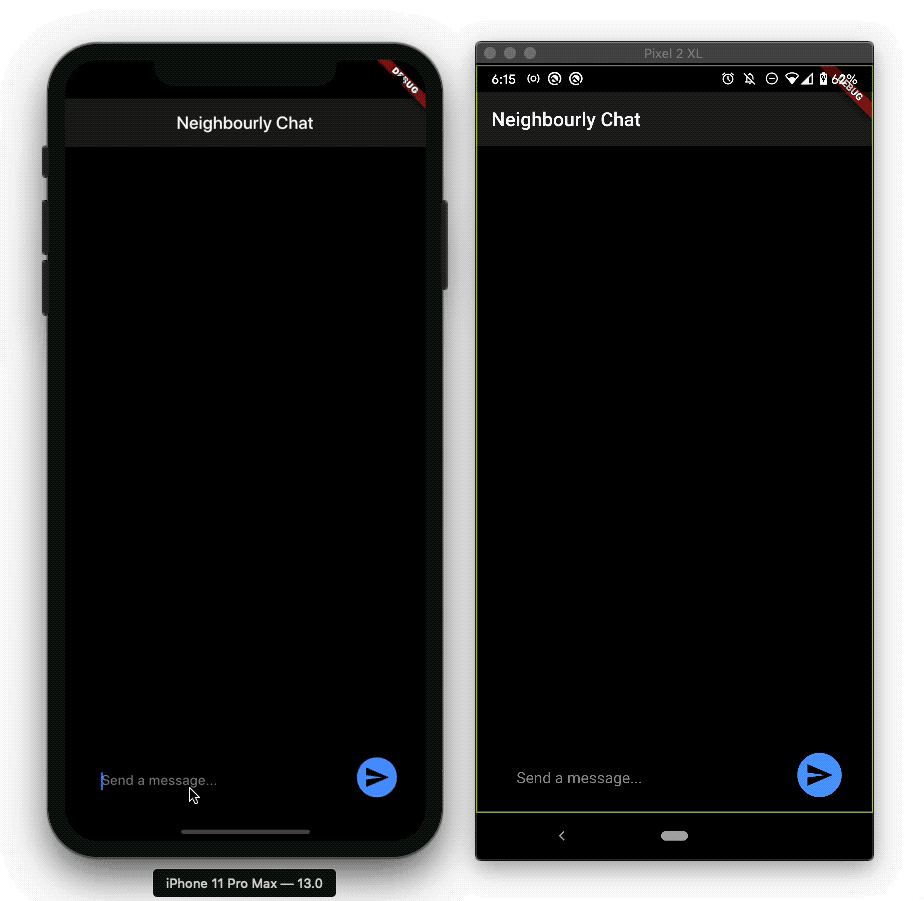

# Flutter Examples

> Compilation work in progress. You can find other public samples at https://github.com/joshuadeguzman/flutter-examples-archive.

Collection of Flutter Apps

| Flutter Moviehub | Flutter Firestore CRUD |
| ------------------------------------------------------------------ | ------------------------------------------------------------------------ |
|  |  |


| Flutter Persistence | [Flutter Nike Shop](https://codepen.io/joshuadeguzman/pen/jObrzJB) |
| ------------------------------------------------------------------------ | --------------------------------------------------------------------- |
|  |  |

| [Flutter Nike Sb Showcase](https://codepen.io/joshuadeguzman/pen/BaojbKo) | [Neighbourly Chat](https://github.com/joshuadeguzman/neighbourly-chat) |
| ------------------------------------------------------------------------ | ------------------------------------------------------------------------ |
|  |  |

## Example apps

1. [Flutter Moviehub](https://github.com/joshuadeguzman/flutter-examples/tree/flutter_moviehub)
2. [Flutter Firestore CRUD](https://github.com/joshuadeguzman/flutter-examples/tree/flutter_firestore_crud)
3. [Flutter Persistence (Local Data and Secure Storage)](https://github.com/joshuadeguzman/flutter-examples/tree/flutter_persistence)
4. [Flutter Nike Shop (Cube Transform Effect)](https://github.com/joshuadeguzman/flutter-examples/tree/flutter_protopie_nike_shop)
5. [Flutter Nike Sb Showcase (Staggered Animations)](https://github.com/joshuadeguzman/flutter-examples/tree/flutter_dribbble_nike_sb)
6. [Neighbourly Chat (Real-time chat application powered by socket.io)](https://github.com/joshuadeguzman/flutter-examples/tree/neighbourly_chat)

## Setup

Clone the repo

```
$ git clone https://github.com/joshuadeguzman/flutter-examples
```

Select a project

```
$ cd <project_name>
```

Install dependencies

```
$ flutter packages get
```

Run the app

```
$ flutter run -v
```

## Contact

### Let's connect

- Twitter [@joshuamdeguzman](https://twitter.com/joshuadeguzman)
- Keybase [@joshuadeguzman](https://keybase.io/joshuadeguzman)

### If this helped you, please don't forget to show some 💙

[⭐](https://github.com/joshuadeguzman/flutter-examples/stargazers) this repo or follow me on:

- Github [@joshuadeguzman](https://github.com/joshuadeguzman)
- Medium [@joshua.deguzman](https://medium.com/@joshua.deguzman)

## Credits

- [Protopie Nike by Xavier Lacoste](https://cloud.protopie.io/p/j2Fusg5L7dg)
- [Nike SB by Dimest](https://dribbble.com/shots/4322176-Nike-SB)

## License

[BSD](LICENSE.md) @joshuadeguzman
